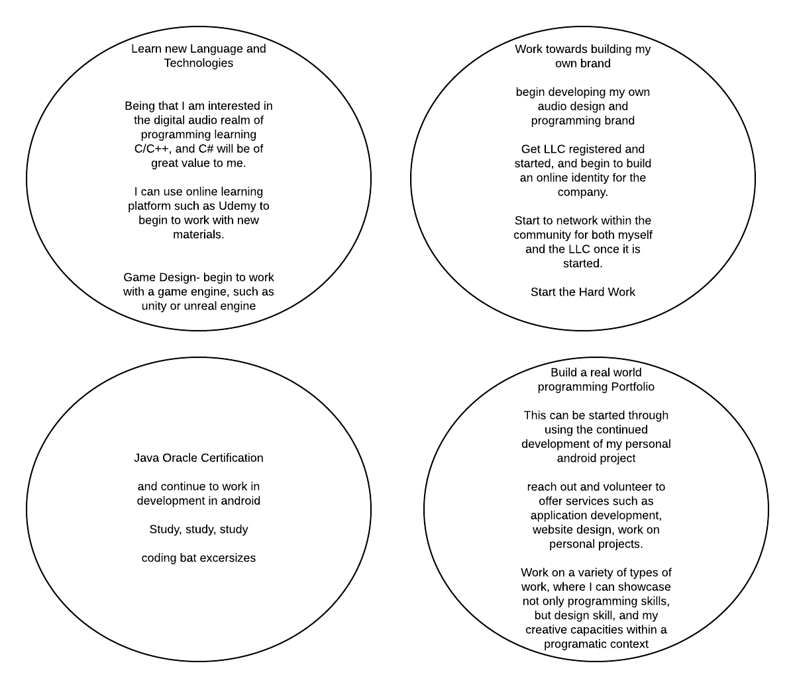

# prodev

[Resume](MatthewJonesResume.pdf)
<a href="linkedin.com/in/matthew-jones-674743b6">LinkedIn</a>

## Week One- Purpose

### What
  * Use of coding/programming for the development of software for music and audio applications. 
  
### Why

 * Because I am passionate about music, and the technological innovations that have effected how music is created in the digital age.

### How 

 * Through exploration and experimentation with audio softwares and hardwares that will lead to the development of unique and interesting user experiences when creating thier music.  

### Q and Q

 * Quantative 
   * Worked 7 or more years with out calling out sick once.  
   * Worked with fellow associates to raise store sales to the goal of $20,000 per week, which was a goal set upon us by our      owners and managers
   * I had worked for World of Warcraft, and at the time I had little knowledge of the game as I did not play it, but I worked hard and adapted so that I was able to meet the hourly ticket quota of 10 tickets per hour, while still being able to produce auality service and adhere to to outlined policies of the job.
   
 * Qualitative 
   * Reliable and Loyalty, I had been raised to take these types of qualities as important, and to an extent they are quite important, but this is a type of a quality that can be taken advantage of.  
   * Empathy, in the field of customer service empathy can be an important quality that can be used to graciously aid a customer 
   with thier needs, but it could be a double edged sword in the fact that it can make you feel like you are not being as helpful as you can when a situation arises when you actually unable to help someone becuase of policies etc.
   * Organization, I am typically an organized individual and feel that basic organization is an important aspect of productive workflow ets, but also I feel that this quality can get in the way in being that if something is not organized in particular ways or to my preferences it can become a burden because I would feel that it would need to be reorganized before and real work done would be done. 

## Weekly Reflection 

I think the biggest takeaway for me this week, concerns itself with the professional development aspect of the bootcamp.  I feel that this aspect of the bootcamp will be on of the more challenging pieces for me, but I feel that it will also be the most rewarding.  I feel that the excercises we had worked on during the week, has helped me to realize that although I have a different background from the technology field I still have plenty to offer to employers within the tech market.  I also realized that many of what I would have typically considered strength characteristics could have also been a hinderance for me in the past. For example, I am and would consider myself to be a very dependable and loyal employee, and although I have seen this as a strength I am now able to see that there have more than likely been many instances in a work setting where this characteristic has been used against me, or used as a carrot to lead me into a direction that my employers would have never intended to reward me with, just to keep the hard work out of me.  

## ProDev Buddy 

Alana Chigbrow

## Elevator Pitch 

Hello my name is Matthew, and I am working to change the landscape of digital audio and music.  I do this because I am passionate about music and the innovations that digital age has changed the way people make music.  I intend to to make a mark on the digital audio industry through the development of unique and interesting softwares and hardwares that can create unique experiences for users and the audiences they create content for.  So, are you ready to make some music?

## Week Two - Identity

### Visuals Speak

I picked the empty sign as a symbol representing my current professional status.  I picked this ultimately because I feel that I 
dont really have much of a professional status.  Many of my previous jobs have been what I would call dead end jobs, where there was no real room for advancement or personal growth.  I more recently graduated from UNM and feel as if I am stuck, caught in a catch 22 where I am unable to find any meaningful work because of my lack of experience, while also being afraid to take many risks to gain experience also because of my lack of experience.  I chose the colorful fan as a symbol of where I would like to 
be in three years because I felt that it is representative of an object branching out. I hope that in the next three years, I am able to gain much needed real working world experience that will allow me to branch out into into the industry feilds of my interest.  I plan on getting there by branching myself out, to become more active and participate within the communities that represent my interests, I plan on working on personal projects that will help me gain the confidence needed to feel worthy of my participation, and I also plan on establishing myself within the software development community or workforce to gain much needed professional experience.   

### Who am I 

I am a software developer, I'm working with digital audio/sound processing technologies and protocols.

I am a maker, I am currently working with programming, midi technology, and arduino to explore unique and alternative
midi "instrument"/hardware methodologies. 

I am a sound designer, who is currently working with programming languages and audio middleware for audio assest implementation 
within the context of video game design.  

### Recruiter/Weekly Reflection

I was unable to find much information when trying to search for myself online, mainly for two reasons.  for One I have not been very active within online communities, and the other reason is because of "The Real Matt Jones" who I have known about but he is an Albuquerque based musician who shares the same name as myself and apparently he is more the real deal than myself.  I did find my personal linked in profile.  Currently this profile is unfinished and it shows, no profile picture, the resume is outdated, and there is little activity in regards to making contacts with colleagues within my areas of interest.  So as a recruiter I would find this to be representative of someone uninterested in developing themselves professionally.  This is what I will need to address, I will need to be willing to engage through online social networking, in order to both network and present a beeter professional image of myself.  For now I will plan on using LinkedIn, and SoundCloud as possible platforms for me to further engage myself in the online world, Ultimately I would like to set up my own personal website, that will have portfolio of my work etc.  The big takeaway for me this week is that even though I may not like social networking, especially on the internet, I do see that it can be invaluable when it comes to the bigger picture of my personal goals.  

## Week Three, Comming soon, regardless if it can be graded or not need to reflect on the teambuilding excersize, and how I am trying to currently cope with the teambuilding aspects of the capstone project. 

## Week Four Persuasion 

### Finding Contacts 

Here I am to identify a contact from one nonprofit organization, and one for profit organization 

#### Non Profit 

YDI- 

Dept. 
Education, Employment, & Training 
Concha Cordova
Vice President 
505-352-3446
ccordoca@ydinm.org

I can bring value to the company, through introducing and engaging the children in creative coding........
try to introduce workshops and/or seminars that can be attended by the youth to engage them in coding, 
creative arts, and how these concepts can connnect with one another, while sparking an interest in the tech
industry and computing technology through a creative lens.

#### For Profit 

### Four Burners Activity 

### Reflection 

I think that after begining to do some research about how I can fit into companies, I have began to realize that I could possibly offer alot more that I have previously believed.  Also through doing my bootcamp specific homework I have also realized that I am much more interested in front end development, UI interaction, and design that I thought I would have ever thought.  

