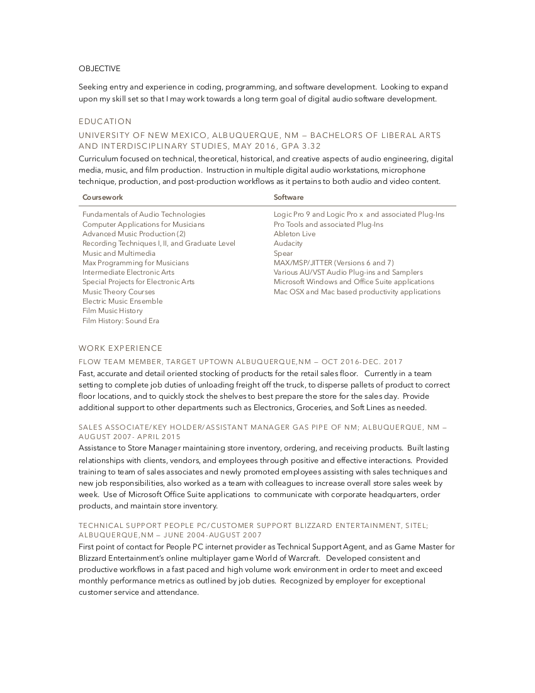

# prodev

## Purpose

### What
  * Use of coding/programming for the development of software for music and audio applications. 
  
### Why

* Because I am passionate about music, and the technological innovations that have effected how music is created in the digital age.

### How 

* Through exploration and experimentation with audio softwares and hardwares that will lead to the development of unique and interesting user experiences when creating thier music.  

## Weekly Reflection 

I think the biggest takeaway for me this week, concerns itself with the professional development aspect of the bootcamp.  I feel that this aspect of the bootcamp will be on of the more challenging pieces for me, but I feel that it will also be the most rewarding.  I feel that the excercises we had worked on during the week, has helped me to realize that although I have a different background from the technology field I still have plenty to offer to employers within the tech market.  I also realized that many of what I would have typically considered strength characteristics could have also been a hinderance for me in the past. For example, I am and would consider myself to be a very dependable and loyal employee, and although I have seen this as a strength I am now able to see that there have more than likely been many instances in a work setting where this characteristic has been used against me, or used as a carrot to lead me into a direction that my employers would have never intended to reward me with, just to keep the hard work out of me.  

## ProDev Buddy 

Alana Chigbrow

## Elevator Pitch 

Hello my name is Matthew, and I am working to change the landscape of digital audio and music.  I do this because I am passionate about music and the innovations that digital age has changed the way people make music.  I intend to to make a mark on the digital audio industry through the development of unique and interesting softwares and hardwares that can create unique experiences for users and the audiences they create content for.  So, are you ready to make some music?
